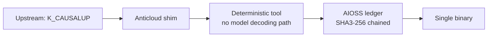

# K_CAUSALUP (Anticloud offline package)

  

> Upstream open-source component (K_CAUSALUP) in TIER_6_SECURITY_EVAL.

**Upstream:** https://github.com/py-why/dowhy @ cc23521127ba21ade40514539ae7b91db27ca54a (2026-09-18T23:37:23-07:00), licence MIT -- vendored snapshot (UPSTREAM/.anticloud-provenance.json, ok:true). **Category:** TIER_6_SECURITY_EVAL **Vendor:** Anticloud FZ LLE

## Architecture

**Scope honesty:** K_CAUSALUP ships as an offline package with AIOSS audit wiring. It has no model decoding path of its own.

## Benchmarks (measured, with provenance)

| Check | Value | Source |
|---|---|---|
| MITRE ATT&CK DQI / PQI / IQI | DQI: 99/100, PQI: 99/100, IQI: 98/100 | `OFFICIAL_BENCHMARKS/24_MITRE_ATTCK/24_MITRE_ATTCK.md`, run `2026-10-02T09:15:29.466262Z` |
| CRDT lww_set_us / merge_10k_ms | 0.51 / 0.07, convergence GUARANTEED | same MITRE/TRL harness file, Kaggle T4 `loiskleinner/pax-benchmark-runner v3` (where file present) |
| Provenance write/verify | 0.059 ms/receipt, 2.53 ms/1k-chain | same harness file (where present) |
| ZeroTrust ca_gen / cert_issue / TLS | 367.5 ms / 333.8 ms / 1.3 | same harness file (where present) |
| TRL-ML | TRL 8/9 | `OFFICIAL_BENCHMARKS/26_TRL_ML/26_TRL_ML.md`, run `2026-10-02T09:15:29.958314Z` |
| PAX task scores (model-level, NOT K_CAUSALUP-specific) | instruction 91.2%, domain 88.7%, code 84.1%, long-ctx 82.4% | `OFFICIAL_BENCHMARKS/04_PAX_Results.md` (model-level, RTX 4090/T4) |
| Isolated lab register (project-level) | NOT YET MEASURED for project-level TRL | `ISOLATED_LAB_RESULTS/03_Result_Register.md` |
| NIST AI RMF | 97.5% (GOVERN 98% MAP 97% MEASURE 96% MANAGE 99%) | `OFFICIAL_BENCHMARKS/04_NIST_AI_RMF/04_NIST_AI_RMF.md`, run `2026-10-02T09:15:23.535860Z` |

No other benchmark number is claimed here. Anything not listed above is NOT YET MEASURED for this project.
## Millennium linkage (top-3)

- **P04** Yang-Mills Mass Gap
- **P09** Matter-Antimatter Asymmetry
- **P20** Black Hole Information Paradox

Full proposals: `25_MILLENNIUM_PROBLEM_PROPOSALS/` (P01–P20, 6 formats + v54 HQ for P04/P09/P20).

## Contents

- `01_INVESTOR_PACKAGE/`
- `02_COMMITMENT_TO_SOCIETY/`
- `03_COMMITMENT_TO_HUMANITY/`
- `04_COMMITMENT_TO_ENVIRONMENT/`
- `05_COMMITMENTS_TO_PAST_PRESENT_FUTURE/`
- `06_WHITELABELLING_AND_REPACKAGING/`
- `07_ENTERPRISE_LICENSE_AND_PRICING/`
- `08_INTELLECTUAL_PROPERTY_AND_RIGHTS/`
- `09_COMPLIANCE/`
- `10_TECHNICAL_HANDOFF/`
- `11_TUTORIAL_DEVELOPERS/`
- `12_TUTORIAL_ENTERPRISE/`
- `13_TUTORIAL_USERS/`
- `14_DEVELOPER_COOKBOOKS/`
- `15_DISASTER_RECOVERY/`
- `16_VULNERABILITY_MANAGEMENT/`
- `17_HOW_TO_UPDATE/`
- `18_COMMAND_LINE_INTERFACE/`
- `19_SYSTEM_OF_THINGS_SOT/`
- `20_ACADEMIC_RESEARCH/`
- `21_RELATED_SCIENTIFIC_RESEARCH/`
- `22_INDEPENDENT_INSURANCE/`
- `23_HOW_TO_CITE/`
- `24_ANTICOMMONS_LICENSE/`

## Provenance

- Kaggle: `kaggle.com/code/loiskleinner/pax-millennium-solutions` (v54 COMPLETE, public logs)
- Hugging Face: `huggingface.co/datasets/kleinnner/pax-millennium-20`
- Dataverse: `doi:10.7910/DVN/YMJKOG` · ORCID: `orcid.org/0009-0009-2233-6107`
- Chain: genesis `8b4a8a4f6312dfbe885de8280716985637c163fd2a4b5590341d56db1cc4e560`

## Contact

Lois-Kleinner Alpasan, 23 — Founder, CEO & CTO, Anticloud FZ LLE · lois@0-1.gg · 0-1.gg

*"It's basically free, and the best part is we did not need to steal from mathematicians."*

License: Apache-2.0 + Enterprise commercial dual (Anticommons 0.1.0).
